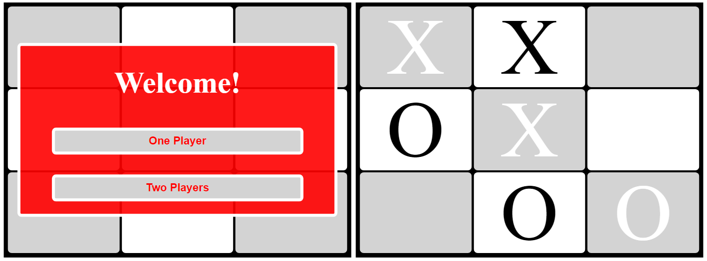
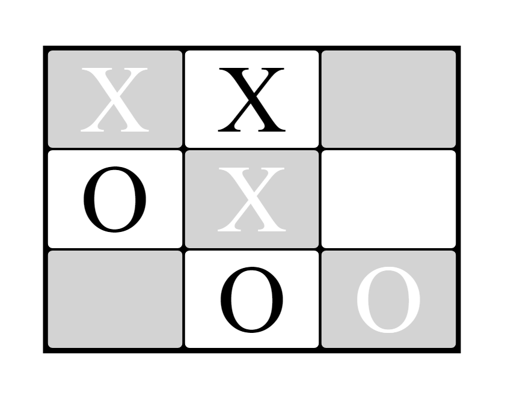

# Tic Tac Toe

# :hammer: Built With
* HTML
* CSS
* JS
* Atom
* Linters

# Screenshots

# Live 
[Play online](https://rayan84.github.io/js---tic-tac-toe/)

#  :bust_in_silhouette: Worked on this challenge:
## Rayan Rassam
* Github:[@Rayan84](https://github.com/Rayan84)
* Twitter:[@Rayan65096267](https://twitter.com/Rayan65096267)
* LinkedIn:[@rayan rassam](https://www.linkedin.com/in/rayan-rassam-18a0a426/)

## Credits
This project was built from scratch

## Contribution
Contributions, issues and feature requests are welcome!
Feel free to check the [Issue](https://github.com/Rayan84/Bubble_sort/issues) and help me improve!
